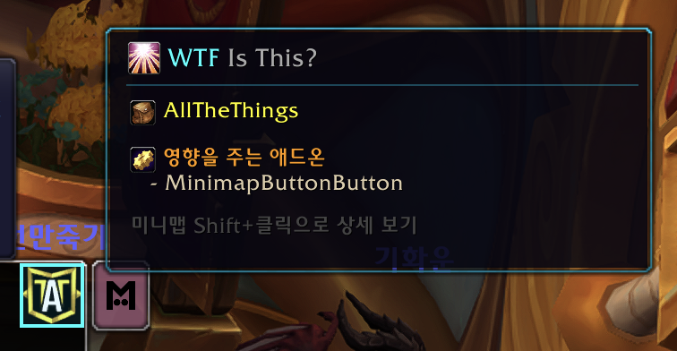
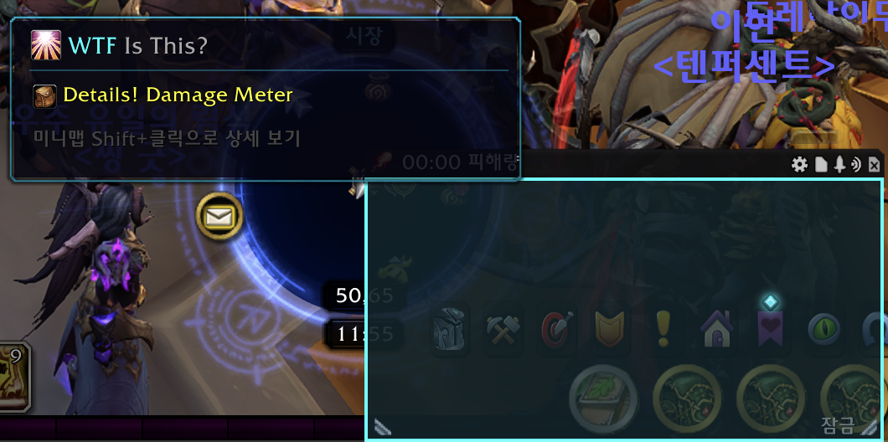
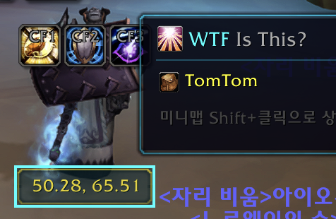
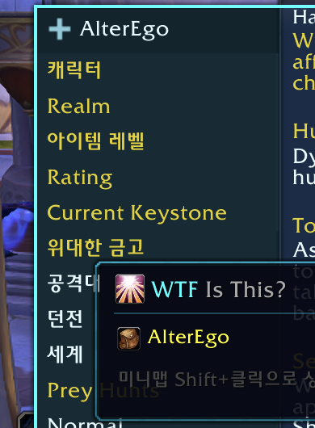

# WTFisThisAddon

-blue)


> Hover over any UI element to find out which addon created it. No more guessing.

---

## 📸 Screenshots

| | |
|:---:|:---:|
|  |  |
| AllTheThings — with affecting addon info | Details! Damage Meter — full frame highlight |
|  |  |
| TomTom — coordinate display | AlterEgo — character info panel |

---

## ✨ Features

- 🔍 **Instant identification** — hover over any UI element to see which addon created it
- 🔷 **Blizzard UI detection** — correctly identifies native WoW frames including `Blizzard_*` modules
- ⚙️ **Affecting addons** — reveals when other addons are also involved in the same UI area
- 🖼️ **Highlight overlay** — cyan border + subtle tint shows exactly which frame is selected
- 📌 **Minimap button** — integrated with LibDBIcon, works with minimap button managers
- 🌐 **Localization** — Korean (koKR) and English (enUS) supported
- 👁️ **Simple / Detail view** — clean one-line result by default, full debug info on demand

---

## 📦 Installation

### Manual
1. Download the latest release
2. Extract to:
   ```
   World of Warcraft/_retail_/Interface/AddOns/WTFisThisAddon/
   ```
3. Enable **WTFisThisAddon** in the AddOns list at the character select screen

### CurseForge
Search for **WTFisThisAddon** on [CurseForge](https://legacy.curseforge.com/wow/addons/wtfisthisaddon)

---

## 🚀 Usage

### First-time setup
The first time you use the addon, it will enable a required console variable and ask you to reload:
```
/wtf
→ "[WITA] SourceLocation enabled."
→ "[WITA] Please /reload and try again."

/reload

/wtf  ← Now works!
```
> This only needs to be done **once**. The setting persists across sessions.

---

### Commands & Controls

| Input | When idle | When scanning |
|-------|-----------|---------------|
| `/wtf` or `/what` | Start scan (simple view) | Stop scan |
| `/wtf detail` | Start scan (detail view) | No reaction |
| **Click** minimap button | Start scan (simple view) | Stop scan |
| **Shift+Click** minimap button | Start scan (detail view) | Stop scan |
| **Drag** minimap button | Reposition around the minimap | — |

---

### Simple view (default)

Shows just the essential info — who made this frame and who else is involved.

```
🔷 기본 UI  (Blizzard_ChatFrame)
   Frame  ChatFrame1

⚙ Affecting addons
   - ElvUI
```

```
📦 WeakAuras

/wtf detail or Shift+Click to restart in detail view
```

---

### Detail view

Full debug information for developers.

```
📦 WeakAuras
   File  WeakAuras\WeakAuras.lua
   Line  2847

Frame   WeakAuras_Anchor_MainGroup
Size    320 x 24  Layer  MEDIUM / 5

⚙ Involved addons
   - ElvUI

Parent chain
  - WeakAuras_Container (WeakAuras)
    - UIParent (Default UI)
```

---

## ⚠️ Limitations

- **~80–90% accuracy** — some frames can't be identified
- Frames created via `loadstring()` or with no name may show as Unknown
- `GetSourceLocation()` requires `enableSourceLocationLookup = 1` (auto-enabled on first use)
- Font strings and textures report their *parent frame's* source location — WoW engine limitation
- Some frames (e.g. HP bars) return secret values for width/height — safely handled, shown as 0

---

## 🔧 How It Works

Uses WoW's `GetSourceLocation()` API to read the file path and line number where each frame was created. By parsing the path (e.g. `Interface\AddOns\WeakAuras\...`), it extracts the addon folder name and maps it to the TOC title. Folders prefixed with `Blizzard_` are treated as built-in UI modules. When source info isn't available, it falls back to guessing from the frame name prefix.

**Key APIs:**
- `GetMouseFoci()` — detects frames under the cursor (WoW 12.0+, replaces removed `GetMouseFocus`)
- `ScriptRegion:GetSourceLocation()` — returns creation file + line number
- `ScriptRegion:GetDebugName()` — fallback debug name
- `Frame:GetParent()` — walks the parent hierarchy
- `C_AddOns.GetAddOnInfo()` — maps folder names to TOC titles

**Libraries:**
- [LibDataBroker-1.1](https://github.com/tekkub/libdatabroker-1-1) — minimap button data object
- [LibDBIcon-1.0](https://github.com/Stanzilla/LibDBIcon) — minimap button rendering & management

---

## 📋 Changelog

### v1.1.0
- **Commands** — `/wtf` / `/what` to toggle, `/wtf detail` for detail view
- **Simple / Detail view** — clean default view with optional full debug info via Shift+Click or `/wtf detail`
- **Minimap button** — integrated with LibDBIcon; now works with minimap button managers (Minimap Button Bag, etc.)
- **Blizzard_ detection** — `Blizzard_*` addon folders now correctly identified as Default UI
- **Affecting addons** — shown in simple view for all frame types
- **Localization** — Korean (koKR) and English (enUS)
- **Bug fix** — secret number values from HP bars no longer cause Lua errors

### v1.0.1
- **Bug fix** — replaced removed `GetMouseFocus()` with `GetMouseFoci()[1]` (WoW 12.0+)
- **Bug fix** — Mac path separator (`/`) now normalized to `\` for correct addon detection

### v1.0.0
- Initial release

---

## 📄 License

[MIT](LICENSE) © 2026 kimgod1142
